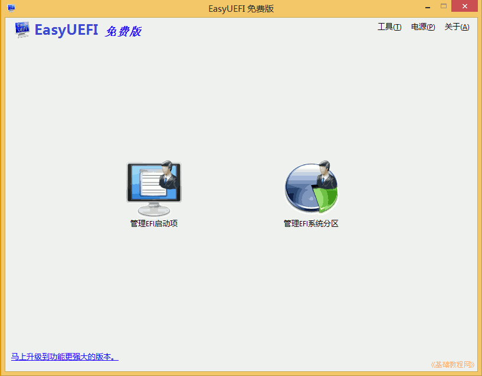
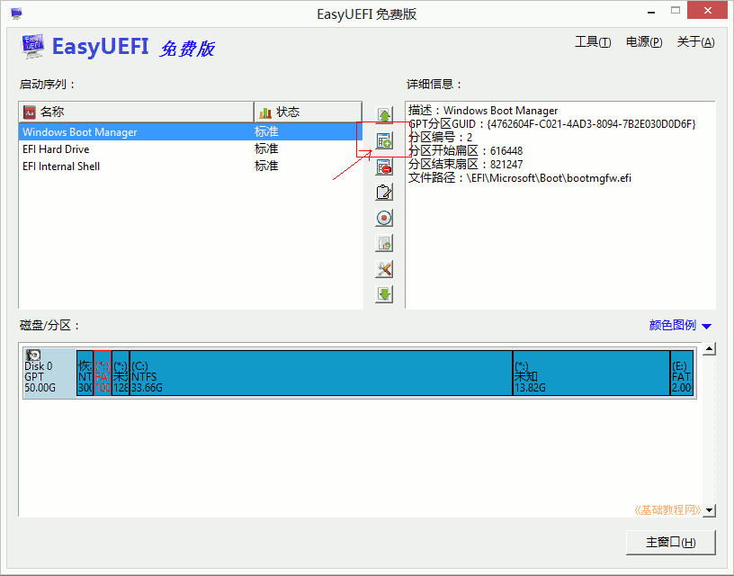
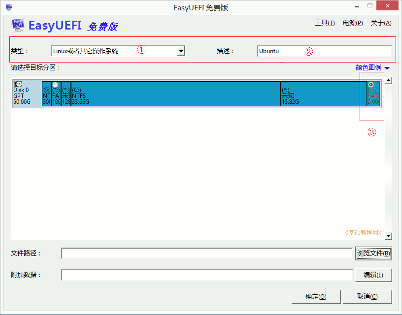
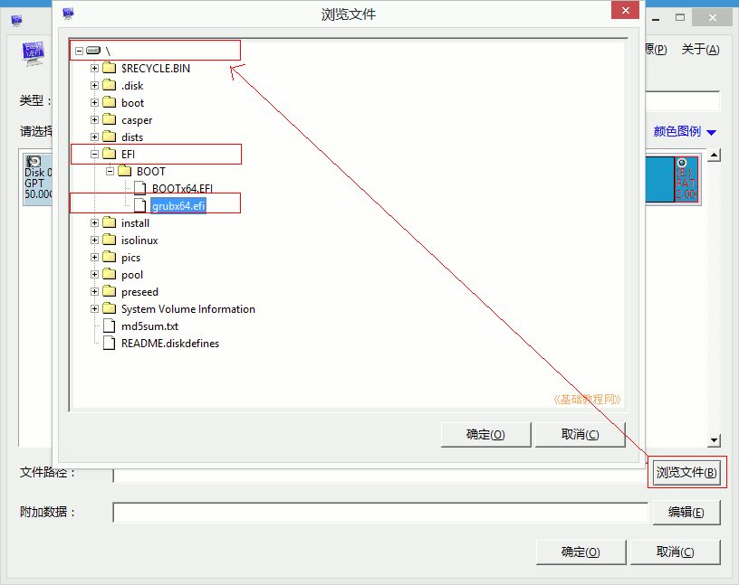
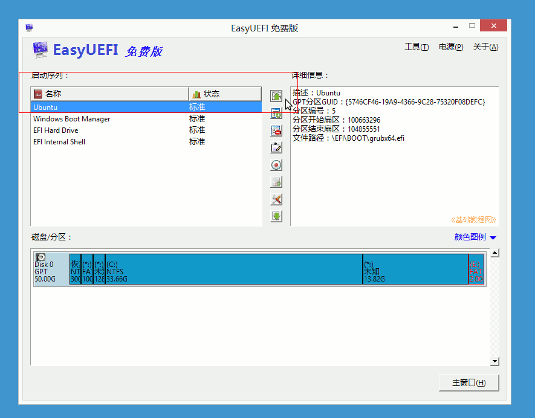

以 dell G7 为例
参考 [https://www.cnblogs.com/iamnewsea/p/7701464.html](https://www.cnblogs.com/iamnewsea/p/7701464.html)

#### 1. win10中，分区, 分出5G（FAT32格式）放ubuntu安装文件， 100G用来安装ubuntu   
{} 
出现问题，尝试用diskgen修改硬盘分区为MBR格式
{}
#### 2. win10中，将 ubuntu.iso 解压到 5G的盘中
#### 3. 安装 EasyUEFI，添加启动项，设置5G盘为启动项

1. EasyUEFI个人版是免费的，可以在官网或友链下载： http://www.easyuefi.com/index-cn.html，下载完后双击运行安装，
2. 在出来的安装对话框中，一路点“继续、确定、完成”，一般默认选中了简体中文；  
安装完自动运行，或双击桌面上图标运行，进入主窗口，再点“管理EFI启动项”

3.在出来程序窗口中间栏，点击第二个绿色加号图标的“添加新项目”；

4. 在出来的面板上边类型里选择Linux，右边文本框里输入名称“Ubuntu”，然后在中间的分区图表中，选中后边的FAT32分区，上边有个圆点；

5. 再点右下角的“浏览文件”按钮，在面板中依次点开加号，找到“\EFI\BOOT\grubx64.efi”，点“确定”；

6. 点“确定”返回主窗口，在左边的启动列表里，选中“Ubuntu”，点中间第一个绿色向上箭头，调到第一位，点击返回主窗口；
  
7. 关闭所有窗口，重启计算机，可以按“win键+R”调出运行框，输入 `shutdown.exe -f -r -t 0`  
{} 
出现问题，关闭win10快速启动。bios中关闭安全启动，修改 STAT为 ACHI? 
{}

#### 4. F12启动，安装ubuntu，新建800M的分区给/boot，100G给/，设置启动项安装到/boot所在分区，/sda5?
        

 
