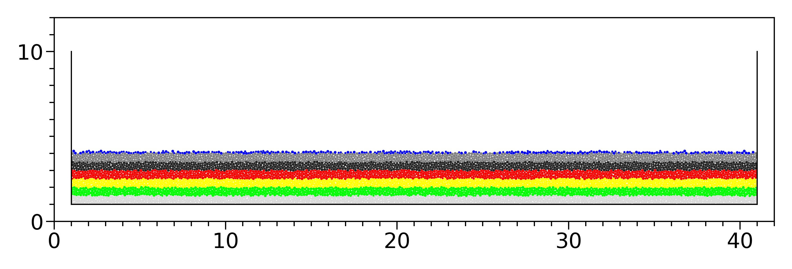
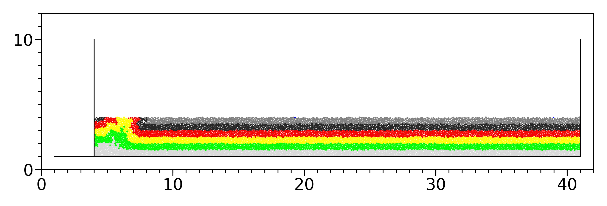
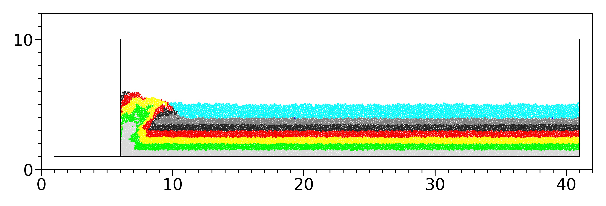
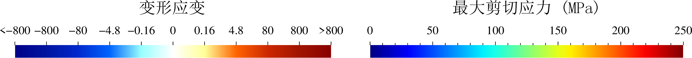
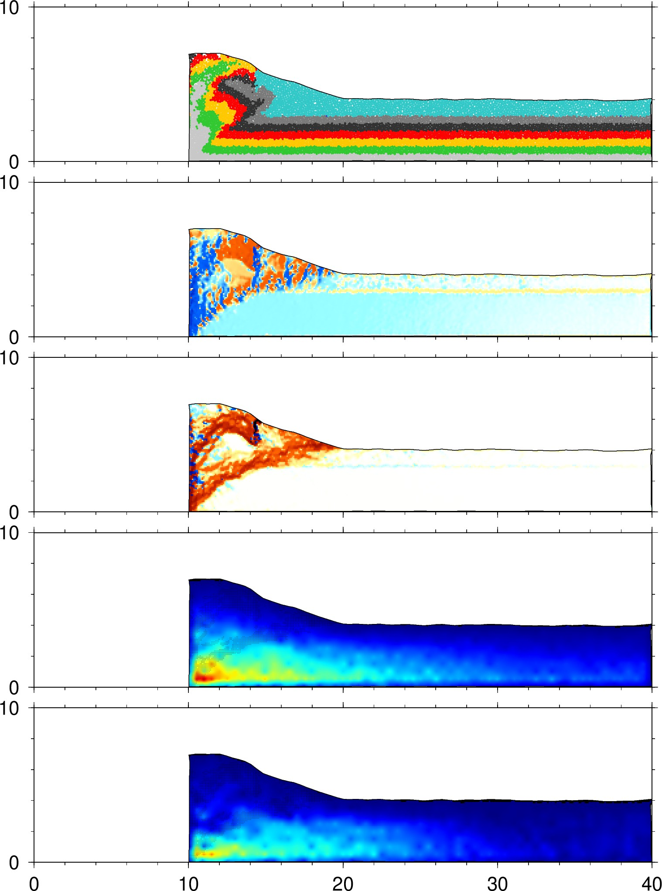

VBOX正式发布前，功能体验。

## 应力应变处理

处理应力应变，需要按照如下步骤做预处理，之后把 `datass` 文件夹和 `jpg` 文件发我


1. vboxdaily 计算，将生成./data文件夹
```
vboxdaily push.py
```

2. 生成jpg，生成计算过程图．注意：这里，只需指定--dir，不加其它任何参数．
```
vbox2jpg --dir=./data
```

3. 新建datass文件夹，根据jpg挑选需要计算应力应变的.dat文件，复制到datass文件夹中。

    这里，挑选原则如下：

    - 刚沉积完，并给定颜色，准备挤压的初始模型，必须。all_0000006000_ini.dat
        
    - 刚剥蚀完，准备挤压的模型，必须。all_0000036000_ini.dat
        
    - 沉积稳定，准备挤压前的模型。all_0000058000_ini.dat
        
    - 沉积过程不要，其它的可酌情选取。
    - 注意:　这里选好dat后，将它们复制到datass文件夹中，文件名中_ini需要去掉．上面三个文件可以改为　
         - all_0000006000.dat
         - all_0000036001.dat
         - all_0000058000.dat

4. 用vboxdaily将dat转换文件格式为.out，供GMT绘图用。注意：基于步骤2，我们知道 `--xmove --ymove` 应该设置为多少．
    ```
    vboxdaily --xmove -1000.0 --ymove -1000.0 -g 400 --leftwallid 1 -s ./datass
    ```
    参数解释：
    ```
	-s, --strain-stress  DataDir
		计算应力应变
		从DataDir读取数据，将应力应变输出到DataDir/ss目录
	--xmove X
		配合-s选项，设置模型x方向偏移位移X，默认0.0。
	--ymove Y
		配合-s选项，设置模型y方向偏移位移Y，默认0.0。
	-g, --grid SIZE
		配合-s选项，设置应力应变计算时候，网格的大小SIZE，默认200.0
	--leftwallid ID
			设置左边墙ID，该墙左边颗粒均会被删除。如果颗粒被挤出到左边墙之外需要设置该参数。
	--rightwallid ID
		设置右边墙ID，该墙右边颗粒均会被删除。如果颗粒被挤出到右边墙之外需要设置该参数。
    ```

5. 没有沉积剥蚀，跳过改步。如果有沉积剥蚀，需要遍历所有文件，正确搜索删除沉积颗粒的位移，为每个.out生成.out-
```
vboxsspre --dir=./datass
```
(后续版本将合并到第二步)

6. 使用GMT绘制应力应变 `vboxss --dir =./datass` (待发布！)
把datass文件夹和jpg文件发我，我使用GMT绘制应力应变图把datass文件夹和jpg文件发我，我使用GMT绘制应力应变图


### 总结

挑选完dat文件后，可用下文的　`lsf2.sh` 提交计算

### 实例

* `bsub < lsf1.sh` 提交，将完成步骤 1和2
* 新建datass文件夹，将需要处理的dat复制到datass文件夹(自己选dat)　
* `bsub < lsf2.sh` 提交，将完成步骤 4和5
* 把datass和jpg发给李长圣，等待处理结果！



<center>all0000108000.jpg</center>

目录结构

```
|-- ex1
    |-- lsf1.sh
    |-- lsf2.sh
    |-- push.py
    |-- data
        |-- landscape
        |-- .gitignore
        |-- Gruntfile.js
        |-- LICENSE
        |--  all_0000000000_ini.dat
        |--  all_0000001000.dat    
        |--  all_0000002000.dat    
        |--  all_0000003000.dat    
        |--  all_0000004000.dat    
        |--  all_0000005000.dat    
        |--  all_0000005000_ini.dat
        |--  all_0000006000.dat    
        |--  all_0000006000_ini.dat
        |--  all_0000016000.dat    
        |--  all_0000026000.dat    
        |--  all_0000036000.dat    
        |--  all_0000036000_ini.dat
        |--  all_0000046000.dat    
        |--  all_0000056000.dat    
        |--  all_0000056000_ini.dat
        |--  all_0000056100.dat    
        |--  all_0000056200.dat    
        |--  all_0000056300.dat    
        |--  all_0000056400.dat    
        |--  all_0000056500.dat    
        |--  all_0000056600.dat    
        |--  all_0000056700.dat    
        |--  all_0000056800.dat    
        |--  all_0000056900.dat    
        |--  all_0000057000.dat    
        |--  all_0000057100.dat    
        |--  all_0000057200.dat    
        |--  all_0000057300.dat    
        |--  all_0000057400.dat    
        |--  all_0000057500.dat    
        |--  all_0000057600.dat    
        |--  all_0000057700.dat    
        |--  all_0000057800.dat    
        |--  all_0000057900.dat    
        |--  all_0000058000.dat    
        |--  all_0000058000_ini.dat
        |--  all_0000068000.dat    
        |--  all_0000078000.dat    
        |--  all_0000088000.dat    
        |--  all_0000098000.dat    
        |--  all_0000108000.dat    
    |-- datass
        |-- all_0000006000.dat
        |-- all_0000026000.dat
        |-- all_0000036000.dat
        |-- all_0000036001.dat
        |-- all_0000056000.dat
        |-- all_0000058000.dat
        |-- all_0000078000.dat
        |-- all_0000108000.dat
```

其中，

`lsf1.sh`

```
#!/bin/bash
#
#BSUB -J sheng
#BSUB -q mpi
#BSUB -n 24
#BSUB -R "span[ptile=24]"
vboxdaily push.py
vbox2jpg --dir=./data   
convert -delay 100 ./data/*[0-9].jpg -loop 0 ./data/process.gif   
```

`lsf2.sh`

```
#!/bin/bash
#
#BSUB -J sheng
#BSUB -q serial
vboxdaily --xmove -1000.0 --ymove -1000.0 -g 400 --leftwallid 1 -s ./datass
vboxsspre --dir=./datass 
```

`push.py`
```
######################################
# title: 一个实例学会VBOX 加入剥蚀 沉积 演示应力应变处理过程
# date: 2019-01-13
# authors: 李长圣
# E-mail: sheng0619@163.com
# note:
# 括号内参数可根据模型大小及个人需要修改
# 脚本命令不区分大小写
# 用16个核心，实际用时<1小时
# 计算费用约<2元
# more info, see www.geovbox.com
#######################################
#程序初始化
START
#颗粒设为球，计算颗粒体积用4/3*pi*r^3计算
set disk off
#设置研究范围 
BOX left 0.0 right 42000.0 bottom 0.0 height 12000.0 kn=0e10 ks=0e10 fric 0.00 
#设置挡板墙，这里模型采用hertz接触模型，挡板墙的kn ks无效，计算时取颗粒的参数
WALL ID 0, NODES (   1000.0 ,   1000.0 ) (  41000.0 ,   1000.0 ), kn=0e10 ks=0e10 fric 0.0 COLOR black
WALL ID 1, NODES (   1000.0 ,  10000.0 ) (   1000.0 ,   1000.0 ), kn=0e10 ks=0e10 fric 0.0 COLOR blue
WALL ID 2, NODES (  41000.0 ,   1000.0 ) (  41000.0 ,  10000.0 ), kn=0e10 ks=0e10 fric 0.0 COLOR red
#在矩形范围内生成颗粒
GEN NUM 100000.0 rad discrete 60.0 80.0,  x ( 1000.0, 41000.0), y ( 1000.0, 10000.0), COLOR black GROUP ball_rand
#设置颗粒的微观参数
PROP DENSITY 2.5e3, fric 0.0, shear 2.9e9, poiss 0.2, damp 0.4, hertz
#设置时间步及重力加速度
SET  DT 5e-2,  GRAVITY  0.0,  -10.0
#设置每1000步保存一次ps格式的计算结果
SET  ps 1000
#设置每1000步保存一次dat格式的计算结果
SET  print 1000
#沉积，计算5000步
CYC 5000
#删除4000米以上的颗粒
DEL RANGE y 4000.0 999000.0
#平衡，计算1000步
CYC 1000
#输出包含颗粒的[x y r]信息的初始模型 init_xyr.dat
#EXP init_xyr.dat

#设置bond粘结，使颗粒具有粘聚力
PROP ebmod 2e8 gbmod 2e8  tstrength 2e7 sstrength 4e7 fric 0.3 
#给地层赋上颜色
PROP COLOR lg          range y 1000.0  1500.0
PROP COLOR green       range y 1500.0  2000.0
PROP COLOR yellow      range y 2000.0  2500.0
PROP COLOR red         range y 2500.0  3000.0
PROP COLOR black       range y 3000.0  3500.0
PROP COLOR mg          range y 3500.0  4000.0
PROP COLOR blue        range y 4000.0  4500.0
PROP COLOR gb          range y 4500.0  5000.0
PROP COLOR violet      range y 5000.0  5500.0

#设置挡板墙摩擦系数
WALL id 0 fric 0.3
WALL id 1 fric 0.3
WALL id 2 fric 0.3
#设置墙的挤压速度 x方向速度为2.0
WALL id 1 xv 2.0
#设置墙的挤压量x方向推进3000.0，每挤压2000.0保存一次计算结果
IMPLE wall id 1 xmove 3000.0 save 2000.0 print 1000.0 ps 1000.0

##################################### 剥蚀 #####################################
# 删除4000米以上的颗粒
DEL RANGE y 4000.0 999000.0
################################################################################

#设置墙的挤压量x方向推进3000.0，每挤压2000.0保存一次计算结果
IMPLE wall id 1 xmove 2000.0 save 2000.0 print 1000.0 ps 1000.0

##################################### 沉积 #####################################
#停止挤压，墙的x方向速度改为0.0
WALL id 1 xv 0.0
#沉积。在挤压前端12000～40000.0上方，沉积约 1 km 颗粒。y的范围需要设置为4000-6000。
#经验：颗粒充填满2km范围，沉积之后的地层厚度约为1km
GEN NUM 100000.0 rad discrete 60.0 80.0,  x ( 10000.0, 41000.0), y ( 4000.0, 6000.0), COLOR gb GROUP sed
#设置沉积颗粒 GROUP=sed 的微观参数
PROP DENSITY 2.5e3, fric 0.3, shear 2.9e9, poiss 0.2, damp 0.4, hertz range GROUP sed
#计算2000步，让颗粒沉积下来
SET print 100 #每 100 步输出一次计算结果
CYC 2000
################################################################################

#设置墙的挤压速度 x方向速度为2.0
WALL id 1 xv 2.0
#设置墙的挤压量x方向推进3000.0，每挤压2000.0保存一次计算结果
IMPLE wall id 1 xmove 5000.0 save 5000.0 print 1000.0 ps 1000.0

#计算停止
STOP
```
